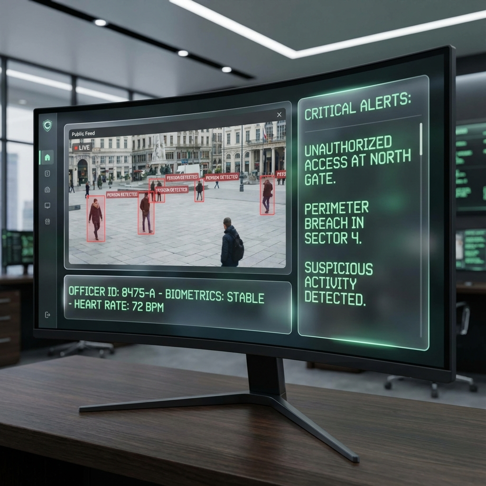

# 🦅 Falcon Eye (FESS) Reference Documentation

Welcome to the official documentation for the **OD-Eye-Security-System (FESS)**. This system is a high-performance, real-time security surveillance platform.

## 📁 Documentation Contents

### 1. [Architecture](./architecture.md)
Detailed breakdown of the system components, technology stack, and backend logic.

### 2. [Data Flow](./data_flow.md)
Step-by-step lifecycle of an alert, from camera lens to the CSS transitions in the HUD.

### 3. [Frontend Interface Concept](./ui_concept.md)
Visual guide to the "Command Center" dashboard and its reactive components.

---

## 🚀 Quick Start
To get the system running locally:

### Backend
1. Create a `.env` file in `backend/`.
2. Install dependencies: `pip install -r requirements.txt`
3. Run: `python -m uvicorn app.main:app --reload`

### Frontend
1. Navigate to `frontend/`.
2. Install dependencies: `npm install`
3. Run: `npm run dev`

---

## 🧪 Visual Concepts

*Conceptual design of the 'Combat HUD' monitoring interface.*
