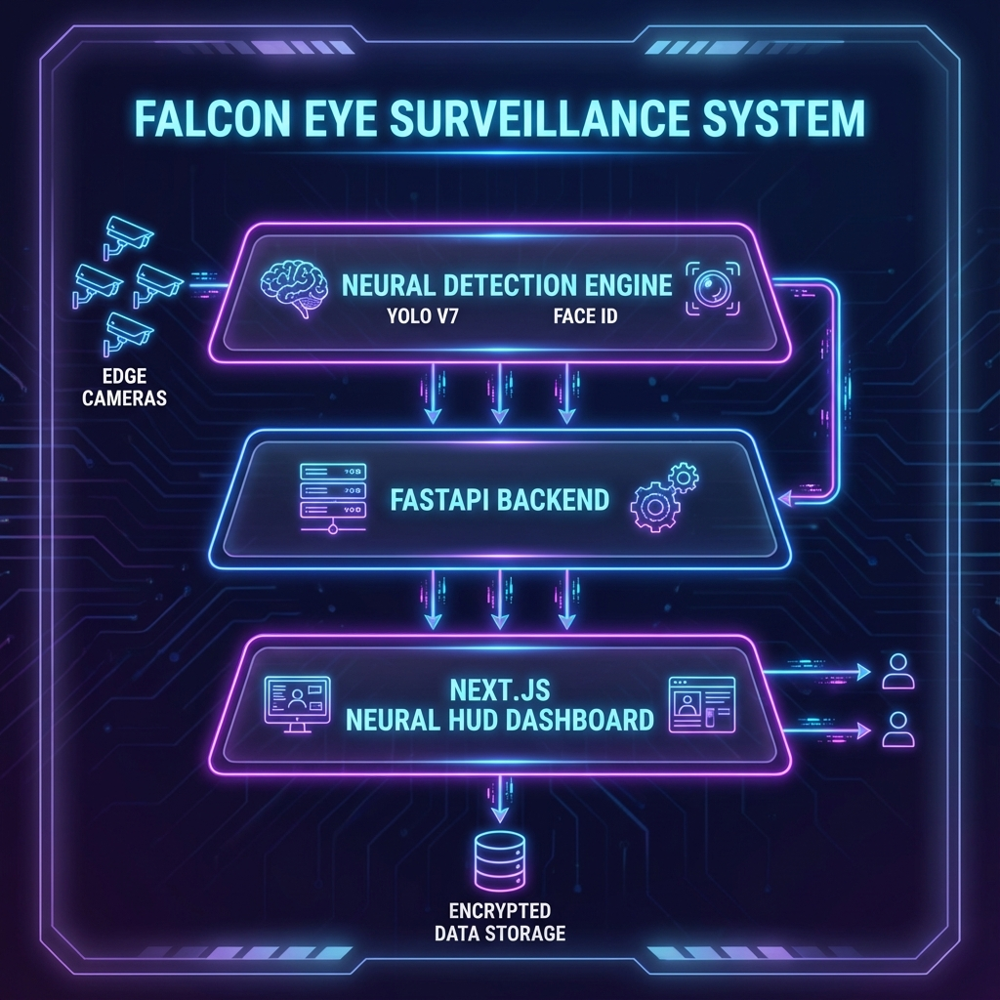

# Falcon Eye Security System (FESS) - Project Architecture

## 🏗️ High-Level Overview
Falcon Eye is a next-generation surveillance platform that combines real-time computer vision with a high-performance web architecture. The system is designed for low-latency detection and immediate response.

### 1. Neural Detection Core (Python/C++)
The "Brain" of the system, responsible for processing raw optical feeds.
*   **Engine**: YOLO v8 (You Only Look Once) for object detection.
*   **Identity**: Face Recognition library for biometric verification.
*   **Task Management**: Runs in dedicated background threads to prevent UI blocking.

### 2. Tactical Backend (FastAPI)
The central command hub that orchestrates data flow.
*   **API Layer**: RESTful endpoints for camera management, user authentication (JWT), and alert history.
*   **Broadcasting**: WebSocket-based push system using the `AlertManager` service.
*   **Persistence**: SQLAlchemy ORM with a robust schema for tracking every security event.

### 3. Command Center HUD (Next.js)
The frontline interface for security officers.
*   **Real-time Stream**: MJPEG-over-WebSocket feed for zero-latency monitoring.
*   **Combat HUD**: Reactive notification system that visually updates based on threat level.
*   **Styling**: Premium Glassmorphism UI built with Tailwind CSS.

---

## 🛠️ Tech Stack
| Component | Technology |
| :--- | :--- |
| **Backend** | FastAPI, Python 3.10+ |
| **Object Detection** | YOLO, OpenCV |
| **Frontend** | Next.js 14, TypeScript, Tailwind CSS |
| **Database** | SQLite (SQLAlchemy) |
| **Notifications** | WebSockets, Telegram Bot API |
| **Authentication** | OAuth2 with Bearer Tokens (JWT) |
